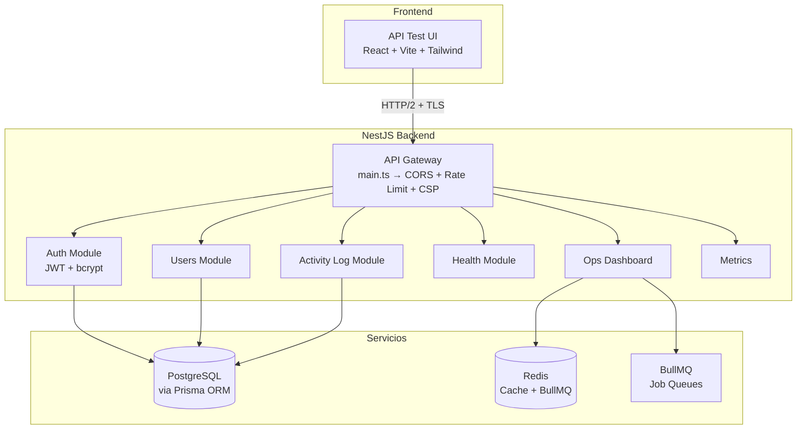

import { DocsLayout } from '../components/DocsLayout';
<DocsLayout>

# Arquitectura del Sistema

## Diagrama de Arquitectura

## Capas del Sistema

### Frontend (API Test UI)

La interfaz de prueba de API está construida con React 18, Vite 5 y Tailwind CSS. Proporciona un entorno ligero similar a Postman para explorar y probar todos los endpoints del backend. Las solicitudes se envían directamente al backend a traves del proxy de Vite en desarrollo (`localhost:5173` → `localhost:3000`).

### API Gateway

El gateway se configura en `main.ts` y aplica a nivel global:

- **Helmet**: Headers de seguridad (CSP, HSTS, X-Frame-Options, X-Content-Type-Options)
- **CORS**: Origenes permitidos configurados via `CORS_ORIGIN`
- **Compression**: Compresion gzip/brotli en todas las respuestas
- **Body size limit**: 1MB maximo para prevenir ataques DoS
- **CSRF**: Proteccion activa solo en produccion
- **Global prefix**: Todas las rutas usan el prefijo `/api/v1`

### Modulos NestJS

| Modulo | Controller | Ruta base | Descripcion |
|--------|-----------|-----------|-------------|
| Auth | `AuthController` | `/api/v1/auth` | Registro, login, JWT, refresh tokens |
| Users | `UsersController` | `/api/v1/users` | CRUD de usuarios (admin) |
| Activity Log | `ActivityLogController` | `/api/v1/activity-log` | Auditoria y tracking de actividades |
| Health | `HealthController` | `/api/v1/health` | Health checks + K8s probes |
| Ops | `OpsController` | `/api/v1/ops` | Dashboard de operaciones |
| Metrics | `MetricsController` | `/api/v1/metrics` | Endpoint Prometheus |

### Persistencia

- **PostgreSQL**: Base de datos principal, accedida via Prisma ORM con migraciones y type safety
- **Redis**: Cache de respuestas (2-tier: Redis + LRU local) y backend para BullMQ job queues

### Sistema de Colas

BullMQ sobre Redis maneja procesamiento asincrono: jobs de auditoria, emails, reportes generados en background.

## Flujo de una Solicitud Tipica

1. El cliente envia una solicitud HTTP a la API
2. El gateway aplica headers de seguridad, CORS, compresion y rate limiting
3. NestJS enruta la solicitud al controller correspondiente
4. Los guards de autenticacion verifican el token JWT (si aplica)
5. Los guards de roles verifican permisos de ADMIN (si aplica)
6. El ValidationPipe transforma y valida los parametros/DTOs
7. El controller ejecuta la logica de negocio a traves del servicio
8. La respuesta pasa por el TransformInterceptor y LoggingInterceptor
9. Se retorna la respuesta al cliente con los headers de seguridad

## Tecnologias

| Tecnologia | Version | Proposito |
|-----------|---------|-----------|
| Node.js | 20+ | Runtime |
| NestJS | 10.x | Framework backend |
| Prisma | 5.x | ORM / Base de datos |
| Redis | 7.x | Cache / Colas |
| PostgreSQL | 16.x | Base de datos relacional |
| BullMQ | 5.x | Job queues |
| Winston | 3.x | Logging estructurado |
| OpenTelemetry | 1.x | Distributed tracing |
| React | 18.x | UI de testing |
| Vite | 5.x | Bundler frontend |
| Tailwind CSS | 3.x | Estilos |
| Swagger | 7.x | Documentacion API |

</DocsLayout>
