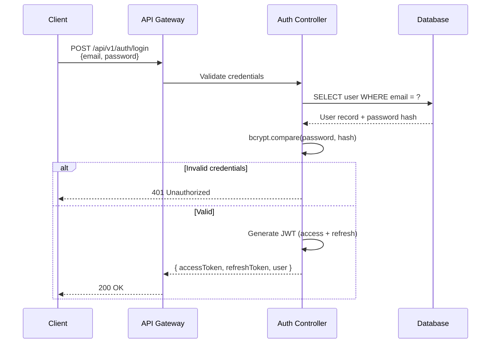
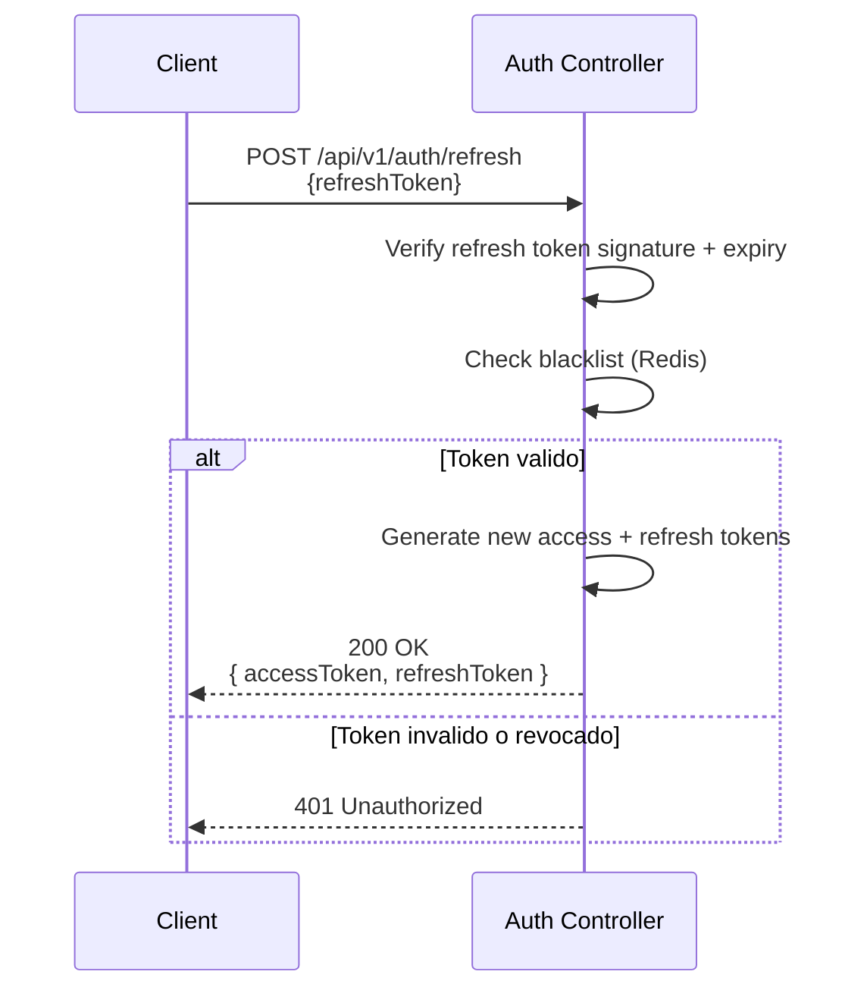
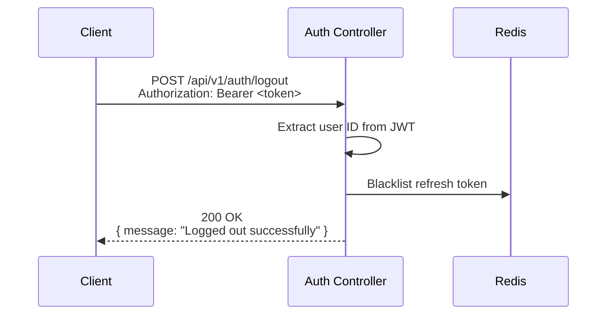

import { DocsLayout } from '../components/DocsLayout';
<DocsLayout>

# Autenticacion JWT

## Flujo de Login



## Estructura del Token JWT

### Header
```json
{
  "alg": "HS256",
  "typ": "JWT"
}
```

### Payload (Access Token)
```json
{
  "sub": "cm7abc123",
  "email": "user@example.com",
  "role": "USER",
  "iat": 1720080000,
  "exp": 1720080900
}
```

### Payload (Refresh Token)
```json
{
  "sub": "cm7abc123",
  "type": "refresh",
  "iat": 1720080000,
  "exp": 1722672000
}
```

## Access Token vs Refresh Token

| Caracteristica | Access Token | Refresh Token |
|---------------|--------------|---------------|
| Duracion | 15 minutos | 30 dias |
| Proposito | Autenticar requests API | Obtener nuevos access tokens |
| Envio | Header Authorization | Body del request |
| Almacenamiento | Memoria del cliente | HTTP-only cookie o almacen seguro |
| Revocacion | No (stateless) | Si (blacklist en Redis) |

## Como Autenticar Requests

En todos los endpoints que requieren autenticacion, incluir el header:

```
Authorization: Bearer <access_token>
```

### Flujo de Refresh



### Flujo de Logout



## Rate Limiting en Auth

El endpoint de login tiene rate limiting especifico: **5 requests cada 15 minutos** (`@Throttle` en el controller). Esto previene ataques de brute force. Al exceder el limite se recibe:

```json
{
  "statusCode": 429,
  "message": "ThrottlerException: Too Many Requests",
  "error": "Too Many Requests",
  "timestamp": "2026-07-04T12:00:00.000Z",
  "path": "/api/v1/auth/login"
}
```

## Roles

El sistema tiene dos roles:

| Rol | Permisos |
|-----|----------|
| `USER` | Acceso a perfil propio, operaciones basicas |
| `ADMIN` | Acceso a gestion de usuarios, activity log, dashboard de operaciones |

Los roles se verifican via `RolesGuard` en cada endpoint protegido.

</DocsLayout>
