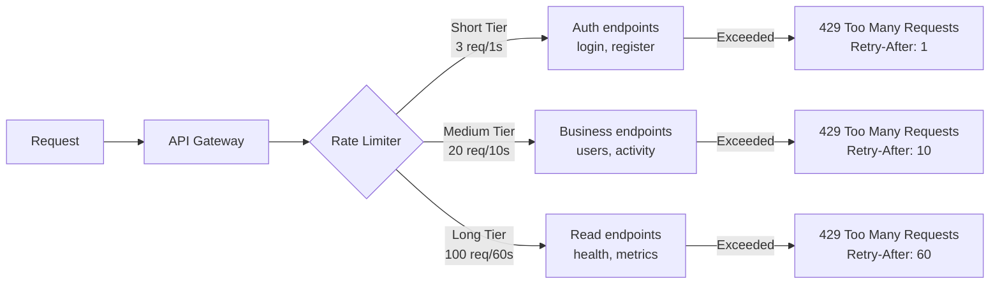

import { DocsLayout } from '../components/DocsLayout';
<DocsLayout>

# Rate Limiting

## Arquitectura de 3 Tiers

El sistema implementa rate limiting de 3 niveles usando `@nestjs/throttler` con almacenamiento en Redis. Cada tier tiene un proposito especifico y se aplica a diferentes grupos de endpoints.



## Configuracion de Tiers

| Tier | TTL | Limite | Uso | Endpoints |
|------|-----|--------|-----|-----------|
| **short** | 1 segundo | 3 requests | Endpoints sensibles que requieren proteccion contra abuso inmediato | login, register |
| **medium** | 10 segundos | 20 requests | Operaciones de negocio regulares | users CRUD, activity log |
| **long** | 60 segundos | 100 requests | Lecturas y consultas | health, metrics, listados |

### Configuracion en codigo (`app.module.ts`)

```typescript
ThrottlerModule.forRoot([
  { name: 'short', ttl: 1000, limit: 3 },
  { name: 'medium', ttl: 10000, limit: 20 },
  { name: 'long', ttl: 60000, limit: 100 },
]),
```

Adicionalmente, el endpoint `POST /api/v1/auth/login` tiene un override especifico via decorador:

```typescript
@Throttle({ default: { limit: 5, ttl: 900 } }) // 5 req cada 15 minutos
```

## Headers de Respuesta

Cuando se aplica rate limiting, todos los endpoints devuelven los siguientes headers:

| Header | Descripcion | Ejemplo |
|--------|-------------|---------|
| `X-RateLimit-Limit` | Limite maximo del tier | `3` |
| `X-RateLimit-Remaining` | Requests restantes en la ventana actual | `2` |
| `X-RateLimit-Retry-After` | Segundos hasta que se reinicia el contador | `1` |

### Ejemplo de respuesta 429

```json
{
  "statusCode": 429,
  "message": "ThrottlerException: Too Many Requests",
  "error": "Too Many Requests",
  "timestamp": "2026-07-04T12:00:00.000Z",
  "path": "/api/v1/auth/login"
}
```

## Algoritmo: Token Bucket

El rate limiting usa el algoritmo **Token Bucket** (sliding window) implementado por `@nestjs/throttler`:

1. Cada tier tiene un bucket con N tokens (el limite)
2. Los tokens se regeneran a razon de N tokens por TTL
3. Cada request consume un token del bucket
4. Si no hay tokens disponibles, se rechaza con 429
5. Los tokens no usados se acumulan hasta el maximo del bucket

```
Ejemplo: Tier short (3 req/1s)

t=0ms    Bucket: [T, T, T]  → Request 1 (consume 1)
t=100ms  Bucket: [T, T]     → Request 2 (consume 1)
t=200ms  Bucket: [T]        → Request 3 (consume 1)
t=300ms  Bucket: []         → Request 4 → 429 Too Many Requests
t=1000ms Bucket: [T, T, T]  → Bucket regenerado
```

## Como Manejar 429

### Con delay exponential backoff

```typescript
async function fetchWithRetry(url: string, options: RequestInit, retries = 3): Promise<Response> {
  for (let i = 0; i < retries; i++) {
    const res = await fetch(url, options);
    if (res.status !== 429) return res;
    const retryAfter = parseInt(res.headers.get('Retry-After') || '1', 10);
    await new Promise((r) => setTimeout(r, retryAfter * 1000 * Math.pow(2, i)));
  }
  throw new Error('Max retries exceeded');
}
```

### Mejores practicas

- Implementar exponential backoff en el cliente
- Respetar el header `Retry-After`
- Distribuir las requests uniformemente en lugar de enviar en bursts
- Cachear respuestas de endpoints GET para reducir la carga
- Usar el Collection Runner de Postman con `--delay-request` configurado

</DocsLayout>
